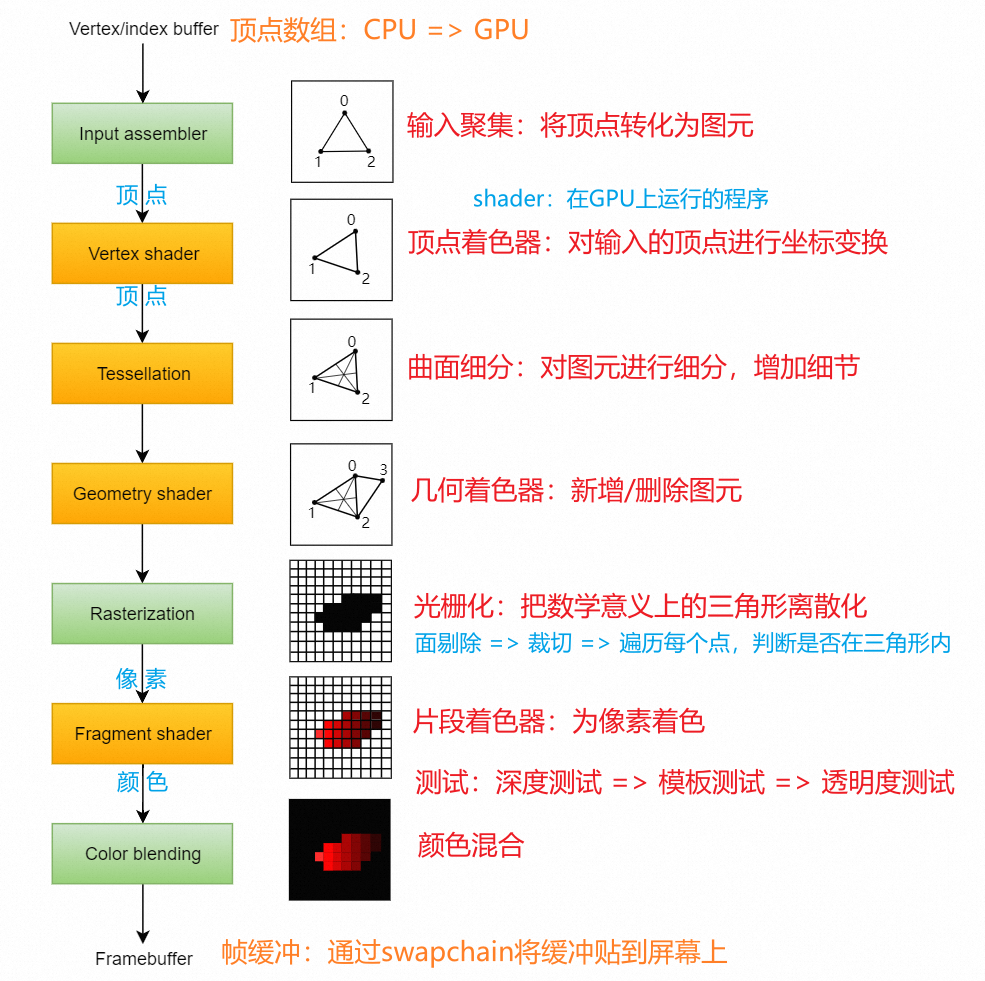

[TOC]

# vulkan绘图的基本流程

准备工作：

1. SDL部分：
   1. 通过SDL接口`SDL_Vulkan_GetInstanceExtensions()`，获取当前系统支持的窗口扩展
      1. Windows下是：`VK_KHR_surface`、`VK_KHR_win32_surface`
   2. 通过SDL接口`SDL_Vulkan_CreateSurface()`，创建一个`vk::SurfaceKHR`，用于后续绘制图像
2. Vulkan部分
   1. 创建实例`vk::Instance instance`
      1. 要在配置中，开启验证层`VK_LAYER_KHRONOS_validation`
      2. 开启当前系统支持的窗口拓展，用于得到屏幕的格式，便于交换链进行格式转换
   2. 获取GPU支持的所有物理设备`vk::PhysicalDevice`，选择其中满足要求的设备`phyDevice`
   3. 获取当前物理设备支持的所有命令队列的属性，根据属性，得到满足要求的命令队列的编号
      1. 需要得到两种命令队列：`graphicsQueue`、`presentQueue`
   4. 基于物理设备，为CPU创建逻辑设备`vk::Device device`
      1. 如果两种命令队列不同，则需要创建不同的`vk::DeviceQueueCreateInfo `
   5. 从逻辑设备中，根据之前得到的编号，获取命令队列`vk::Queue`
      1. 获取图形处理命令队列：`vk::Queue graphicsQueue`
      2. 获取图形显示命令队列：`vk::Queue presentQueue`
   6. 创建交换链`vk::SwapchainKHR`，进行相关配置
      1. 对于每一个图像`vk::Image`，创建图像视图`vk:ImageView`

绘制时：

1. CPU将命令`CommandBuffer`通过命令队列`CommandQueue`传递给GPU

销毁时：

1. 销毁逻辑设备`device`
2. 销毁实例`instance`

# vulkan渲染管线

- 顶点着色器的调用频率 < 片段着色器，因此尽可能将计算放到顶点着色器中
  - 例如矩阵运算
- 在光栅化之前，会进行一次`viewport`变换：$[-1,1]^3 → [0,w][0,h]$

# 帧缓冲 FrameBuffer

每个帧缓冲有多个纹理附件`attachment`，也就是`vk::Image`

- `color attachment`：颜色附件，至少一个，用于存储颜色
- `stencil & depth attachment`：模板&深度附件，用于记录模板/深度值